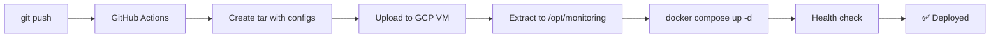

# 📊 Proflyder Infrastructure Monitoring

Централизованная система мониторинга и сбора логов для всех проектов Proflyder.

## 🎯 Что это?

Единый мониторинг стек на базе:
- **Loki** - централизованное хранилище логов
- **Grafana** - визуализация логов и метрик

Позволяет собирать логи со всех проектов в одном месте и просматривать их через веб-интерфейс.

## 🌐 Доступ

- **URL:** https://proflyder.dev/grafana/
- **Логин:** admin
- **Пароль:** установлен через `GRAFANA_ADMIN_PASSWORD`

---

## 🚀 Быстрый старт

### 1. Первоначальная настройка

```bash
# Клонировать репозиторий
git clone https://github.com/your-username/infra-monitoring.git
cd infra-monitoring

# Скопировать .env.example
cp .env.example .env

# Установить пароль для Grafana в .env
nano .env
```

### 2. Локальный запуск (для тестирования)

```bash
# Запустить стек
docker compose up -d

# Проверить статус
docker compose ps

# Просмотреть логи
docker compose logs -f

# Открыть Grafana
open http://localhost:3000
```

### 3. Деплой на production

```bash
# Коммит и push в main/master ветку
git add .
git commit -m "Update monitoring config"
git push origin main

# GitHub Actions автоматически задеплоит на GCP VM
```

---

## 📁 Структура проекта

```
infra-monitoring/
├── docker compose.yml          # Loki + Grafana
├── config/
│   ├── loki-config.yml         # Конфигурация Loki
│   ├── grafana-datasources.yml # Автоподключение Loki
│   └── nginx-grafana.conf      # Nginx конфиг для proflyder.dev/grafana
├── .github/workflows/
│   └── deploy.yml              # CI/CD для деплоя
├── .env.example                # Пример переменных окружения
└── README.md                   # Эта документация
```

---

## 🔧 Конфигурация

### Переменные окружения (.env)

```env
GRAFANA_ADMIN_PASSWORD=your_strong_password
```

**⚠️ Важно:** Используйте надёжный пароль! Генерация:
```bash
openssl rand -base64 32
```

### GitHub Secrets

Для работы CI/CD нужны следующие secrets:

| Secret | Описание | Пример |
|--------|----------|--------|
| `GCC_TOKEN` | Google Cloud credentials JSON | `{"type": "service_account", ...}` |
| `GCC_VM_NAME` | Имя VM в GCP | `proflyder-vm` |
| `GCC_VM_ZONE` | Зона VM | `us-central1-a` |
| `GRAFANA_ADMIN_PASSWORD` | Пароль для Grafana | `strong_password_here` |

### Настройка Nginx

После деплоя нужно один раз добавить конфиг в nginx:

```bash
# На VM выполнить:
sudo nano /etc/nginx/sites-available/proflyder.dev

# Добавить блок location из config/nginx-grafana.conf
# См. подробности в файле config/nginx-grafana.conf

# Проверить конфиг
sudo nginx -t

# Перезагрузить nginx
sudo systemctl reload nginx
```

---

## 📊 Использование Grafana

### 1. Вход в систему

1. Откройте https://proflyder.dev/grafana/
2. Введите логин: `admin`
3. Введите пароль (из `GRAFANA_ADMIN_PASSWORD`)

### 2. Просмотр логов

1. Нажмите на иконку **компаса** (Explore) в левом меню
2. Выберите **Loki** в качестве datasource (уже выбран по умолчанию)
3. Используйте LogQL запросы

### 3. Примеры LogQL запросов

```logql
# Все логи проекта currency-bot
{job="currency-bot"}

# Только ошибки
{job="currency-bot"} |= "ERROR"

# Логи Quartz scheduler
{job="currency-bot"} |= "Quartz"

# Парсинг JSON логов
{job="currency-bot"} | json

# Фильтр по уровню после парсинга JSON
{job="currency-bot"} | json | level="ERROR"

# Поиск по regex в сообщении
{job="currency-bot"} | json | message=~".*timeout.*"

# Логи за последний час
{job="currency-bot"}[1h]

# Логи другого проекта
{job="another-project"}
```

### 4. Создание дашбордов

1. Нажмите **+ Create** → **Dashboard**
2. Добавьте панель → выберите **Loki** datasource
3. Напишите LogQL запрос
4. Настройте визуализацию (Table, Logs, Graph)
5. Сохраните дашборд

---

## 🔗 Подключение проектов

Каждый проект должен запускать свой **Promtail** контейнер для отправки логов в Loki.

### Пример для проекта (currency-bot)

**1. Добавить Promtail в docker compose.yml:**

```yaml
services:
  # Ваш основной сервис
  currency-bot:
    # ...

  # Promtail для отправки логов
  promtail:
    image: grafana/promtail:2.9.3
    container_name: promtail-currency-bot
    volumes:
      - ./config/promtail-config.yml:/etc/promtail/config.yml
      - /var/log/currency-bot:/var/log/currency-bot:ro
    command: -config.file=/etc/promtail/config.yml
    restart: unless-stopped
```

**2. Создать config/promtail-config.yml:**

```yaml
server:
  http_listen_port: 9080
  grpc_listen_port: 0

positions:
  filename: /tmp/positions.yaml

clients:
  - url: http://host.docker.internal:3100/loki/api/v1/push

scrape_configs:
  - job_name: currency-bot
    static_configs:
      - targets:
          - localhost
        labels:
          job: currency-bot
          __path__: /var/log/currency-bot/*.log
```

**3. Запустить:**

```bash
docker compose up -d
```

**4. Проверить в Grafana:**

```logql
{job="currency-bot"}
```

---

## 🛠️ Управление

### Docker Compose команды

```bash
# Запустить
docker compose up -d

# Остановить
docker compose down

# Перезапустить
docker compose restart

# Просмотр логов
docker compose logs -f

# Просмотр логов конкретного сервиса
docker compose logs -f grafana
docker compose logs -f loki

# Статус контейнеров
docker compose ps

# Обновить образы
docker compose pull
docker compose up -d
```

### Проверка здоровья

```bash
# Проверить Loki
curl http://localhost:3100/ready

# Проверить Grafana
curl http://localhost:3000/api/health

# Посмотреть метрики Loki
curl http://localhost:3100/metrics
```

### Backup данных

```bash
# Backup Loki data
docker run --rm \
  -v infra-monitoring_loki-data:/source \
  -v $(pwd)/backups:/backup \
  alpine tar czf /backup/loki-backup-$(date +%Y%m%d).tar.gz -C /source .

# Backup Grafana data (дашборды, настройки)
docker run --rm \
  -v infra-monitoring_grafana-data:/source \
  -v $(pwd)/backups:/backup \
  alpine tar czf /backup/grafana-backup-$(date +%Y%m%d).tar.gz -C /source .
```

### Восстановление из backup

```bash
# Restore Loki
docker run --rm \
  -v infra-monitoring_loki-data:/target \
  -v $(pwd)/backups:/backup \
  alpine sh -c "rm -rf /target/* && tar xzf /backup/loki-backup-20231201.tar.gz -C /target"

# Restore Grafana
docker run --rm \
  -v infra-monitoring_grafana-data:/target \
  -v $(pwd)/backups:/backup \
  alpine sh -c "rm -rf /target/* && tar xzf /backup/grafana-backup-20231201.tar.gz -C /target"
```

---

## 🔍 Troubleshooting

### Grafana не открывается (502 Bad Gateway)

```bash
# Проверить что контейнер запущен
docker ps | grep grafana

# Проверить логи
docker logs grafana

# Проверить порт
curl http://localhost:3000/api/health

# Перезапустить
docker compose restart grafana
```

### Loki не принимает логи

```bash
# Проверить статус
curl http://localhost:3100/ready

# Проверить логи
docker logs loki

# Проверить конфигурацию
docker exec loki cat /etc/loki/local-config.yaml
```

### Логи не отображаются в Grafana

1. **Проверить что Promtail отправляет логи:**
   ```bash
   docker logs promtail-currency-bot
   ```

2. **Проверить что Loki получает логи:**
   ```bash
   curl 'http://localhost:3100/loki/api/v1/query?query={job="currency-bot"}'
   ```

3. **Проверить в Grafana Explore:**
   - Выбрать Loki datasource
   - Запросить `{job="currency-bot"}`

### Нет места на диске

```bash
# Проверить размер volumes
docker system df -v

# Очистить старые образы
docker image prune -a

# Очистить старые логи (настроено в loki-config.yml - retention 14 дней)
# Loki автоматически удаляет старые логи
```

---

## 📊 Мониторинг производительности

### Потребление ресурсов

```bash
# Статистика контейнеров
docker stats grafana loki

# Размер volumes
docker system df -v | grep monitoring
```

### Оптимизация

**Loki:**
- Retention period: 14 дней (настроено в `loki-config.yml`)
- Автоматическая компактификация каждые 10 минут
- Лимиты на входящий поток: 10 MB/s

**Grafana:**
- Кеширование запросов: 100 MB
- Отключена регистрация новых пользователей
- Порты доступны только локально

---

## 🔐 Безопасность

### Текущие меры безопасности

✅ **Порты доступны только локально** (127.0.0.1:3000, 127.0.0.1:3100)
✅ **Доступ только через nginx с SSL** (https://)
✅ **Авторизация в Grafana обязательна**
✅ **Отключена регистрация новых пользователей**
✅ **Пароль хранится в secrets / .env**

### Рекомендации

1. **Используйте надёжный пароль** для Grafana (минимум 16 символов)
2. **Включите 2FA** в Grafana (Settings → Profile → Two-Factor Auth)
3. **Регулярно обновляйте** образы Docker:
   ```bash
   docker compose pull
   docker compose up -d
   ```
4. **Мониторьте попытки входа** (Grafana → Server Admin → Users → Login attempts)

---

## 🚀 CI/CD Pipeline

### Как работает деплой



### Триггеры

- Push в `main` или `master` ветку
- Ручной запуск через GitHub Actions UI

### Логи CI/CD

Смотреть в GitHub → Actions → Latest workflow run

---

## 📈 Roadmap

### Планируется добавить

- [ ] **Prometheus** - сбор метрик (CPU, RAM, запросы)
- [ ] **Alertmanager** - алерты в Telegram/Email при ошибках
- [ ] **Готовые дашборды** для типичных метрик
- [ ] **Tempo** - distributed tracing
- [ ] **Автоматические дашборды** для новых проектов

---

## 📚 Полезные ссылки

- [Grafana Documentation](https://grafana.com/docs/grafana/latest/)
- [Loki Documentation](https://grafana.com/docs/loki/latest/)
- [LogQL Query Language](https://grafana.com/docs/loki/latest/logql/)
- [Promtail Configuration](https://grafana.com/docs/loki/latest/clients/promtail/configuration/)

---

## 🤝 Поддержка

Если возникли вопросы или проблемы:

1. Проверьте [Troubleshooting](#troubleshooting)
2. Посмотрите логи: `docker compose logs -f`
3. Создайте Issue в репозитории

---

## 📝 Changelog

### v1.0.0 (2025-12-04)
- ✅ Начальная версия
- ✅ Loki для хранения логов
- ✅ Grafana для визуализации
- ✅ CI/CD через GitHub Actions
- ✅ Работа через nginx на /grafana/
- ✅ Retention 14 дней

---

**Made with ❤️ for Proflyder projects**
